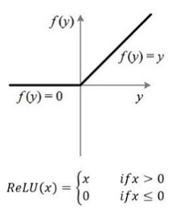
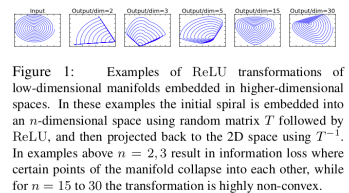
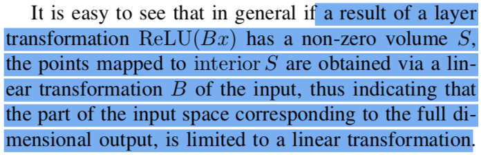
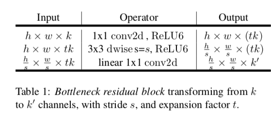
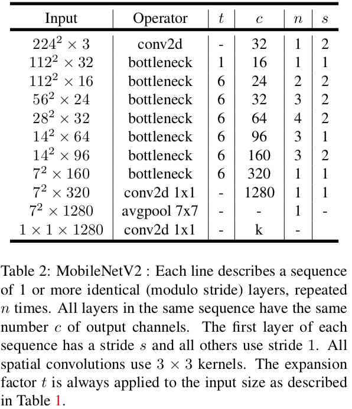
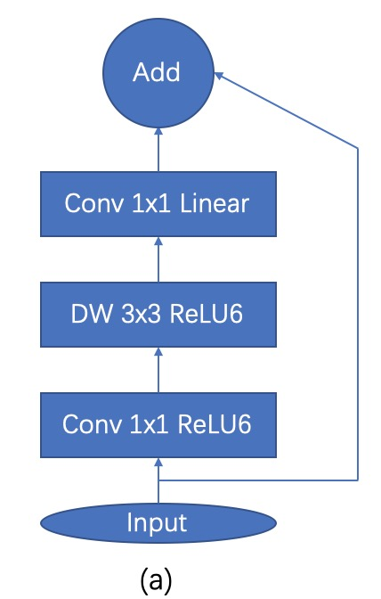
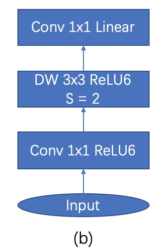

## MobileNetV2
从MobileNetv1的结构来看，没有使用现在比较火residual连接，而是采取了最常见的直筒型网路，那么本文就是从激活函数ReLU层面分析了shorcut的必要性。

我们知道，当图像在网络中流动的时候，一般来说，我们的激活函数是ReLU，从ReLU的性质来看，如果输出是小于0的，那么就会丧失这个部分的信息，因为ReLU在负半轴为0，所以如果我们有一种结构，能够把某些会被ReLU干掉的通道给保存起来，然后输入给下一层，那么我们就可以继续利用这一层的信息，同时这不会增加网络复杂度和参数量，在ReLu计算的那层神经元，该抑制还是得抑制。那么很显然，这一种结构就是ResNet里面的shortcut结构。

ReLU的函数图如下：

文中反复提到：lower-dimentional subspace of the higher-dimentional activation space（翻译过来就是，高维激活空间中的低维子空间）. 我们可以这样来理解（如果理解不对，可以指正批评）：经过ReLU后，某些信息由于是负半轴，所以会被截断，那么此时一部分信息就会被丢失，那么这会对我们后面的特征提取产生影响。但是如果我们的通道数足够多（即下文说的高维度），就算被截断了，由于通道直接或者空间之间会有关联性存在，那么就算丢失了，我们可以将ReLU映射到一定高的维度就可以把丢失的部分信息给“还原”出来，用这样的方式来减少经过ReLU层后信息的丢失。用文中的图来印证：

那么我们如何提取这个低维子空间里的信息呢？ 文中给的方法是用一个线性的瓶颈层（因为非线性会损坏很多信息）。
从原文中，可以看到，对于大于0的部分，ReLU函数是进行了一个线性的转换，所以我们可以用一个线性瓶颈层来提取这些信息。

在反向残差结构中，MobileNetv2首先用一个1x1的卷积对输入进行升维，然后通过正常的卷积层（用ReLU6作为激活函数），最后再用1x1的卷积对结果进行降维。瓶颈层的residual模块如下：

我们可以看到，在第一层1x1的时候，我们对输入进行了升维，升维比例是t倍的输入空间通道数，然后下一层就是正常的3x3深度可分离卷积，最后我们在用1x1降维，降到我们所需要的维度，但是这里要注意，我们的激活函数是线性的，而不是ReLU，因为ReLU会损失信息。（前两层中的第一层用ReLU是因为如果不用激活函数，那么输入到第二层的时候，相当于还是线性的，就没什么用。我们希望拿到非线性的输入，第二层是因为其经过升维后，通道数变多，按照作者意思是可以从这个高维中拿到我们需要的信息，所以这里使用ReLU没有关系）

为什么要使用ReLU6呢？因为对于移动端来说，我们计算肯定不能用float64或者float32，精度太高了且运算量比较大，移动端一般用float16或者更小的。而ReLU6就可以把输出给截断，相当于一个变形的ReLU，当x大于6的时候，输出就为6。

下面是MobileNetV2的网络结构全貌：

图a是stride等于1的连接方式，图b是stride等于2的连接方式。

文中后面还比较了ResNet类的shortcut和本文的shorcut的区别。前者是连接高通道数的，后者是连接低通道数的。也就是说前者进入residual模块时，先降维了，然后再升维，而MobileNetV2则是先升维再降维。

[返回主页](https://github.com/ZH-Lee/Paper-Analysis/tree/master)

