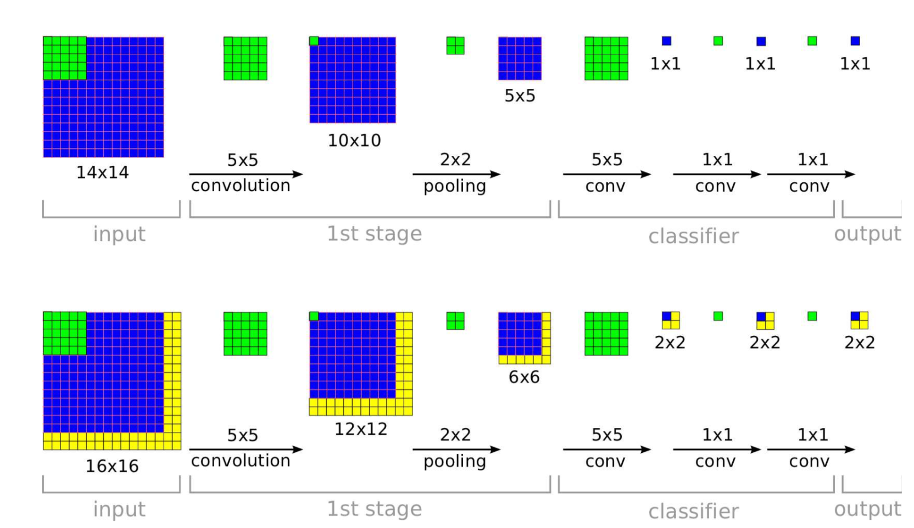

##OverFeat（作者称为特征提取器）
最近阅读了overfeat，发现有很多精华思想，直到现在的state-of-art目标检测网络和语义分割网络都在使用或者改进。所以有必要好好研读以及记录这篇开山之作。

先盗用overfeat论文的一张图。
  
在上图中，对于一个14 x 14的输入，在一顿卷积操作后，得到的是一个5*5的特征图，那么对于传统的分类任务来说，最后一层一定是一个全连接层（Fully connected），以这个例子来说，最后得到1x10（10是分类任务的类别数）全连接层到输出层的参数个数是5x5x10。那么如果我们的输入不是14x14，而是28x28怎么办？经过同样的操作，我们得到的是12x12的特征图，此时由于网络的设定是全连接层到输出层的参数是250个，但是我现在有14x14x10=1960个，就无法进行训练。所以这样是不人道的。因为对于分类来说，缩小到固定尺寸倒影响不大，但是对于检测任务来说，各种目标的尺寸都不一致，无法都固定到相同大小，所以全卷积就成了解决办法。
  
如果我们输入一个16x16的图片，最后可以得到2x2的特征图，这个特征图大小与输入的尺寸有关，最后我们对这2x2个特征图求平均可以得到类别的概率值。另外这个2x2就有了其他的信息如位置信息等，可以用于语义分割或者目标检测。

#### 定位 
为了产生目标的检测框，需要同时运行分类器和bbox回归，这里只需要经过一次网络即可，可以把网络看成是特征提取框，只是最后一层不一样，对于bbox的回归，最后一层需要计算来自特征提取的特征。而分类器则提供了在每一个位置上，类别c是否存在的概率值。  

回归层是一个类别导向的，对于ImageNet数据集来说，1000个类对应1000个bbox，用l2损失对真实框坐标和预测坐标作为优化的方向，即欧式距离。

训练的过程中，排除了与GT box的overlap低于0.5的那些框。

对于目标检测来说，对坐标的预测，我们在不同尺度进行预测，会得到比较好的效果。如果只对一种尺度进行训练，那么对与训练尺度相差不大的目标则有很好的检测效果，对于相差较大的，效果会有折扣。对多尺度特征进行训练的话，会增加预测的准确率。（这里对原文理解不是很好）

#### 结合预测结果
1. 使用6个尺度对图片进行缩放，然后运行分类网络，最后找到类别最大的作为预测类别
2. 对6个尺度的特征进行回归预测坐标点，再将它们合并到bboxes合集。合并过程中，选取任意两个bbox，计算两个框的中心距离加交叉区域面积，如果总和大于某个阈值，则结束，否则将这两个bbox求平均，放入bboxes中，然后删除这两个bbox。

下一步就需要进行最终的预测。从这个bboxes合集中挑选具有最大类置信度的框。

#### 检测任务
检测任务和定位任务最大的不同就是检测任务需要预测背景。

###总结
OverFeat有以下缺点：

1. 虽然使用共享卷积对计算进行加速，但是由于在多尺度上进行贪婪的滑动窗口计算，从另一方面加大的计算量，使得总计算量增大
2. 对小目标的预测能力弱，这个缺点来自于当时没有表达能力强的backbone作为特征提取。