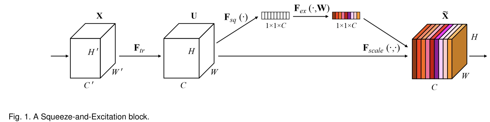
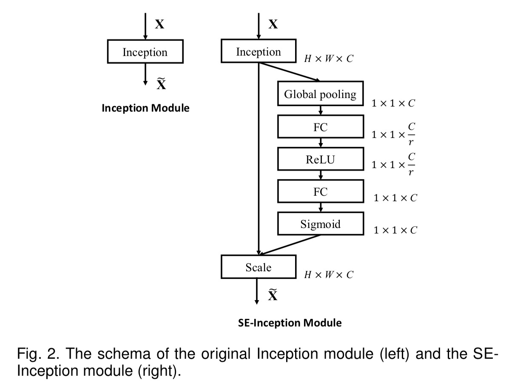

## SENet（应该是SE block）

传统的神经网络在做卷积的时候，是直接把空间信息和通道信息在**局部区域上**进行了融合。为了得到更多的特征信息，一般的做法是寻找表达能力更强的空间信息，但是反过来想，对于一个分辨率不高的图片信息，再经过多层的下采样后，空间信息就变得很少了，此时为了不让信息的表达能力变弱，一般会把通道数增加。但是简单的增加通道数不会带来很明显的增益，因为在传统神经网络中，通道直接是没有交流的，（通道交流可以看看ShuffleNet），另外通道直接是有相关性的。并且通道直接的权重也是相同的，也就是说，我们把每一个通道都看成同等的重要。但是这肯定不是一个好办法。

SENet就提出这样一个问题：是否每个通道对结果的贡献都是相同的呢？通过实验验证不是这样的，而是对每层通道施加一个权重，可以使得结果变得更好。那么我们就来一步步分析一下SENet是怎么做到。

SENet通过对通道相关性进行建模，给每个通道分配权重来提高表达能力。

SENet网络如下：

首先，对网络做一个变换，**F***tr*，具体做法是，用一个二维空间核对输出每一个通道做卷积，然后对所有的通道进行简单求和相加，得到一个**u**1（此时通道之间的相互依赖关系是隐含在其中的，加上通道之间的关系是相当局限的，不能看到全局依赖。）,然后重复以上步骤，得到整个**U**，但是此时对于每一个**u**i来说，由于卷积核都是作用于局部感受野上的，获得的响应也是局部的）。然后使用全局池化在空间方向上压缩空间（不是压缩通道），就可以得到一个某通道上全局的信息，得到一个1x1xC，这相当于对于每个通道**c**i,都具有一个通道维的全局响应（从**u**1和压缩操作可以看出），这就使得这里的信息都是全局的，并且信息可以被这里U的所有层所使用（这里有一个问题：***为什么不使用concate，因为简单相加可能会使得某些层响应相消***）。随后，这个1x1xC的特征图经过sigmoid操作（作者实验了ReLU和tanh以及sigmoid，最终发现sigmoid最好），获取了每一个通道的权重值，然后再用这个权重值作用于U特征图上，得到新的X特征图。这里的sigmoid个人人为是选择对结果有更大贡献的通道，因为每一层获得的全空间的信息和全通道的信息是不一样的，这里就给获得信息最多的以最大的权重。

那么在这里有一个小插曲：对于网络前几层来说，这种操作是通过共享通道加强了低层表达。在网络最后几层，网络对该特征属于什么类就已经是高度专业了。

下面简单看看SE block的结构：

我们可以看到，首先经过一个全局平均池化得到压缩后的1x1xC的特征图，然后有意思的是经过一个全连接层来降维（降维比例是除以一个降维因子r），然后再用全连接层进行升维（其实在MobileNetV2中提到了，如果使用先升维再使用ReLU，然后再降维其实效果更好，因为如果输入维度降低的话，经过ReLU是会损失信息的，而高维输入则会降低这种损失，具体看我对MobileNetV2的分析，在这里作者应该只是为了降低复杂度吧。）

最后作者还做了一些有趣的实验：研究Ex的分布再不同类的输入图片或同一个类的不同输入图片两种情况的变化。结论是：在最初几层，excitation的分布是大致相同的。也就是说在最初几层，特征通道的重要性是不同类所共享的。越深，则每一个通道对不同类就有不同的激活情况的了。