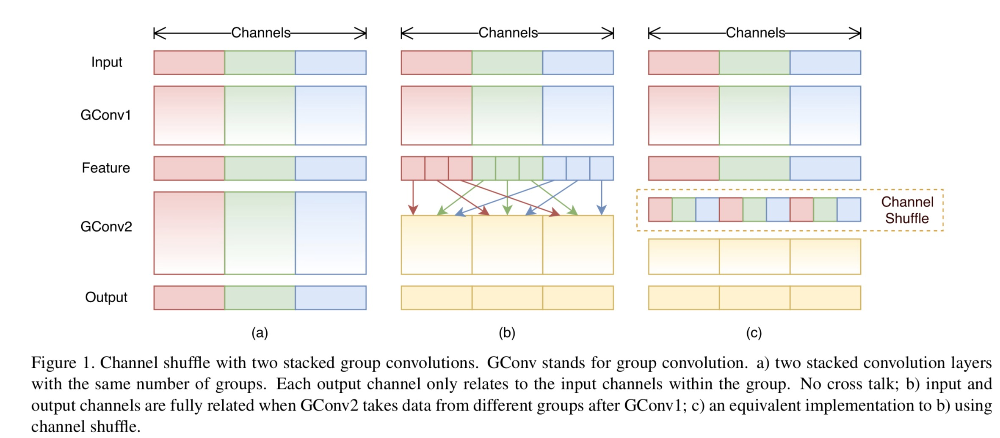
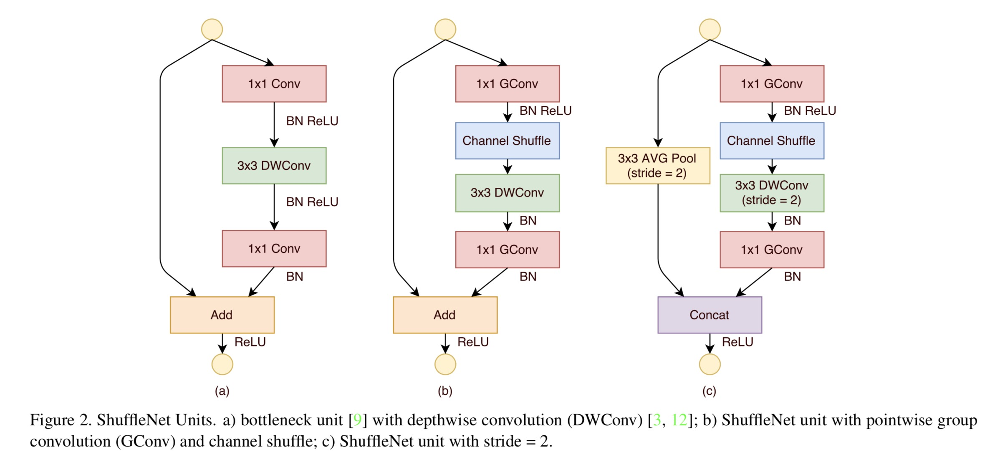
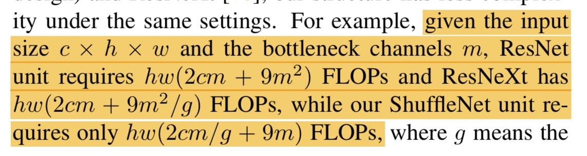

## ShuffleNet

**分析**：

由于最近轻量级网络大热，所以估计很多的文章都会朝向轻量级方向走。从Xception中可以看到，一个网络可以拆分为通道维度和空间维度。并且Xception是先用了一个1x1的卷积把通道维度拿出来，然后再在空间维度上进行卷积。但是这里有一个问题，就是1x1的卷积计算复杂度太高了，所以本文主要是为了减少1x1的计算复杂度，并设计了一种新型的网络结构，这个网络结构允许使用更多的通道数。

本文主要是用了Group卷积的思想，这个思想首次在AlexNet上提出，当时提出来是用于在两块GPU上进行分布式计算。并且在ResNeXt上也得到了成功的应用。但是ResNeXt里面的1x1卷积占据了93%的计算量。而且只在3x3的卷积层是用了gropu卷积。

那么如果网络很小的话，1x1的卷积就会成为瓶颈层，导致无法增加通道数，也就没办法获取足够多的信息。

那么如何解决呢？？本文的解决方法就是使用**通道稀疏连接**（即使用逐点群卷积）。

那么群卷积也不能直接用群卷积，如下图所示：

如果直接使用群卷积，就会得到图（a）的结构，某一个群里面的通道的信息只能由上一层相应群通道来。那么这个群里面就丧失了其他通道的信息。导致信息无法得到很好的交流。本文用了一种方法，如图c所示，把群卷积通道数分割成更小的通道，然后做一个shuffle操作，在组装起来，这个时候，每一个群的信息就会有交叉，信息交流就得到了解决。（这里要注意以下，文中所说的通道稀疏连接意思应该是，如果我分的组越多，那么shuffle后每一个群得到的信息就越多，通道连接越密集，如果就只有一个群，就如图a所示，通道连接就非常稀疏，这里只是我的理解，欢迎讨论）

作者使用了ResNet的经典残差结构作为shufflenet unit。但是不同于resnet的是，shufflenet 的1x1后跟着一个channel shuffle。以及在channel shuffle后使用了3x3的逐深度卷积。但是在这个dw 卷积后是没有使用relu激活函数的，因为在exception里面就提到了，dw是先卷积处理一个通道，处理完后的通道数为1，这个时候信息量本来就少，如果再用relu进行筛选（负半轴信息被砍掉），此时信息就会损失很多。具体见下图

下面是一个FLOPs的复杂度计算

注意这里所说的瓶颈层是第一个1x1 群卷积（可以这样理解这个瓶颈层：一大堆信息流进来，我现在只有一个1x1的口子，那么信息流动就会受到阻碍，就想瓶口一样，我们要喝水，但是瓶口就那么小，水只能一点点流出来。个人理解，仅供参考）。

需要注意的一点是：这里的计算只是理论计算，实际上，会存在一些其他的密集Multiply-Add计算，所载这里作者只在瓶颈层后用了dw 卷积操作。

那么后面的话作者还把MobileNetV1复现了进行对比，然后把SENet的骚操作也放到自己的群卷积里面去，发现放进SENet（请看我关于SENet的分析）后，效果会变得很好。
此外作者还进行了以下实验：

* 使用不同的群数
* 对通道数进行一个缩放（缩放因子s）

但是，新出的MobileNetv2性能也非常强悍，感兴趣请移步MobileNetV2的解析。

