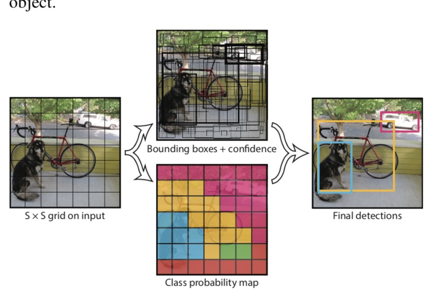
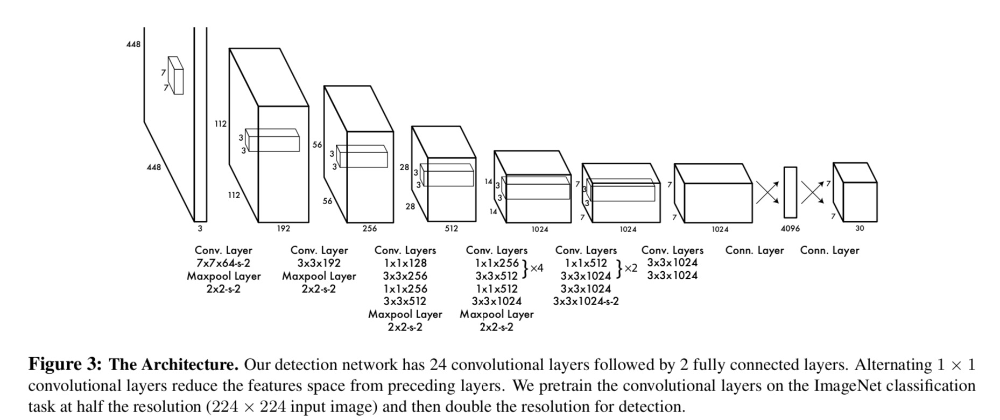
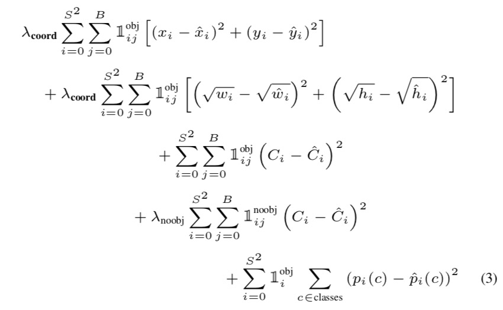

## YOLOv1

文中一开始，作者就表明了YOLO系列的三大特点：

* 速度快，包括检测和训练速度
* 做预测时，具有全局视野
* YOLO能学习物体的泛化表达

下面就一个个解释。

* 将分离的物体检测模块整合成一个单一的神经网络，并且使用全图像的特征来预测bbox。并且对于预测bbox的物体类别是，是对所有的类都做了预测（比如10个bbox，10个类，那么就有100种组合，其中一个bbox对应10类）。这也就意味着，YOLO感受了全局。

YOLOv1的做法是：将图片划为S x S的网格，一个物体的中心落在了某个格子里，那么那个格子就负责检测对应的物体。每一个格子预测B个bbox和一个置信度。这个置信度的意思是：有多确信这个bbox包含了物体以及对这个bbox的预测有多准。由公式Pr(Object) * IOUtruthpred得到。如果没有物体在这个格子内，那么置信度为0。这个bbox就不会对loss有贡献。那么产生的tensor维度是7 * 7 * (2 * 5 + 20)。其中2是每个格子预测两个bbox，每个bbox有5个值，分别是xywh和confidence。

### 网络结构
基本是GoogleNet的设计

### 损失函数的设计

定位误差和分类误差的权重不应该相等，且不包含物体的bbox的权重应该减小，否则会使得梯度很快变小，从而使得网络很快收敛。小物体bbox的一点点偏移的大物体bbox的一点点偏移影响力是不一样的，对于小物体来说，对偏移更敏感。文章中只是加了个bbox高宽的平方根做差。另外，因为一个grid只能预测一个bbox（开始有两个，不过会根据IOU进行筛选），那么对于小物体来说，可能一个格子里面会出现多个物体，这样的话，召回率就很低了。
损失函数如下：

### 缺点
由于YOLO的bbox是从图片中学到的，那么对于新输入，或者新的类别，那么这种泛化能力就不够了，有可能我们输入的都是大的物体进行训练，而测试的时候，我们给的是小物体。也就是说泛化能力不强。

### 总结：
开创了one-stage目标检测的先河。提出了一种新的方法，利用网格划分和多任务loss。基本上比two-stage的检测方法速度快很多，能够达到实时级别的。