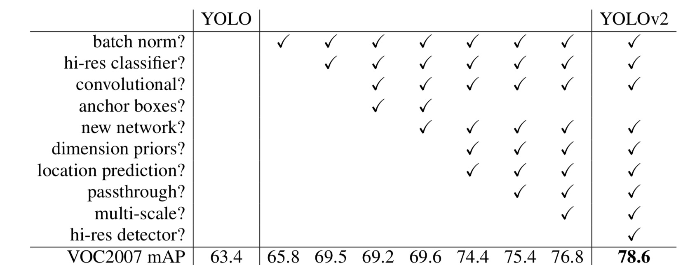
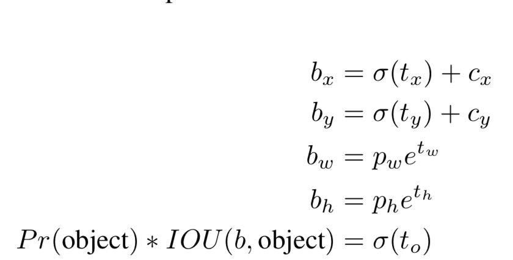
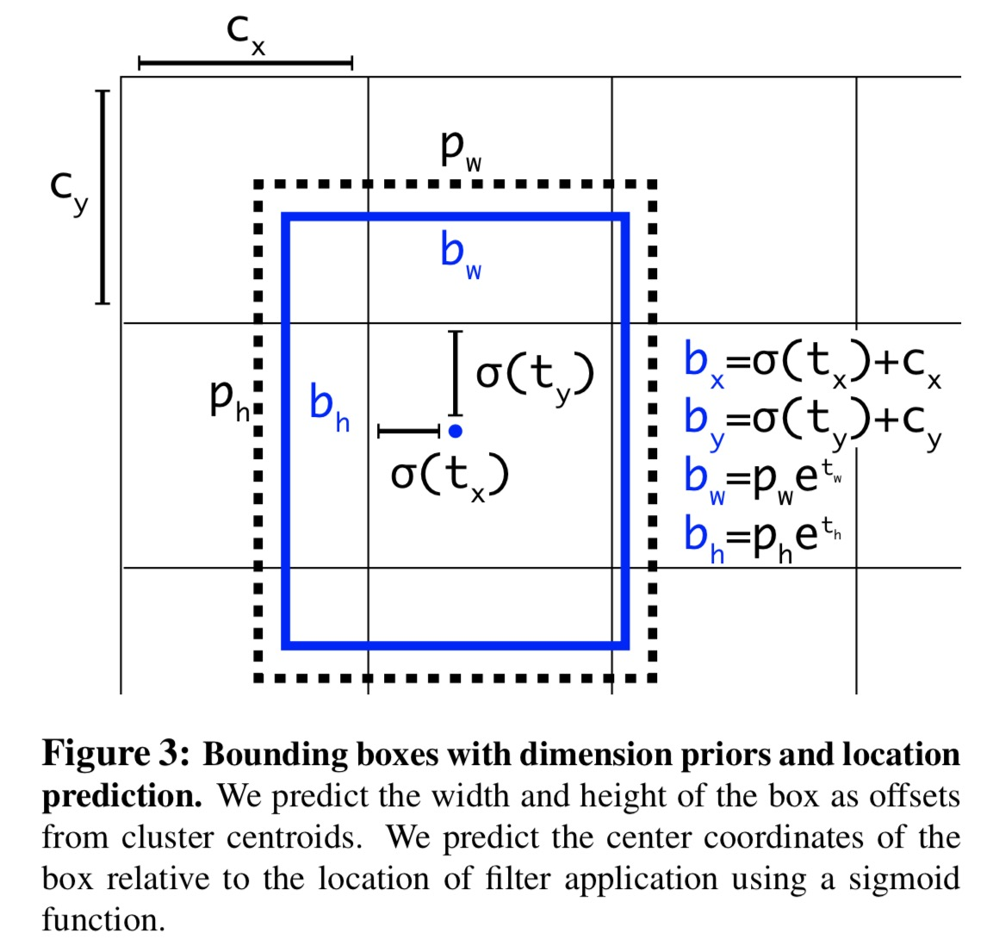
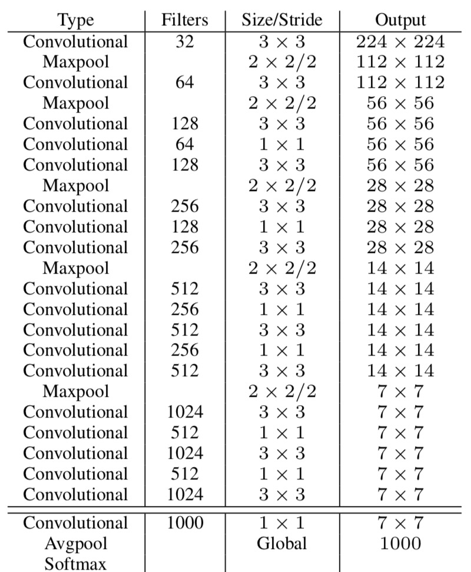

## YOLOv2

第一版的缺点： 相比于faster-rcnn，召回率比较低。定位误差很大

相比于第一版，yolov2有以下改进：

* 使用BN，使得网络更好收敛，同时移除了其他的正则化方法。
* 高分辨率分类器，原来的分类网络是用224x224的图像作为输入，yolov2用更高分辨率的图片，448x448。
* YOLOv1预测坐标回归是利用特征提取层在特征提取器后用一个全连接层来预测坐标值。yolov2使用了类似faster-rcnn的的偏移量和置信度对框进行预测。
* yolov2里面移除了全连接层，并且使用anchor来预测bbox。并且移除了一个池化层来获取更大精度的特征输入。对于图像输入，使用416x416，这样有一个好处，得到的特征图是奇数，那么如果物体很大，就可以占据中间的位置。这样就可以在一个很小的范围内进行偏移，如果是偶数的话，那么就存在一个问题：使用哪个像素做中心点。
* 与faster-rcnn选择anchor box不同的是，yolov2使用k-means来选择anchor boxes，其中距离的度量是使用1-IOU。那么如果IOU越大，则距离越小。
* 为了能够检测到小物体，在三个不同尺度的特征图上用anchor进行预测。
* 多尺度学习。用了不同大小的输入进行学习，因为是全卷积，没有全连接层，也就不会对输入有限制。

与yolov1的对比表如下：

计算坐标的示意图和公式如下：

图中的pw和ph是prior的宽和高，也就是模版高和宽。

在这，作者首次利用darknet作为特征提取器。

在训练的时候，作者还使用了一种新方法，将图像分类数据和图像检测数据混合。如果碰到的输入事图像分类，则只更新分类部分的网络，如果遇到检测数据集，则更新网络所有部分。

### 参考

[YOLOv2](https://blog.csdn.net/leviopku/article/details/82588959)
