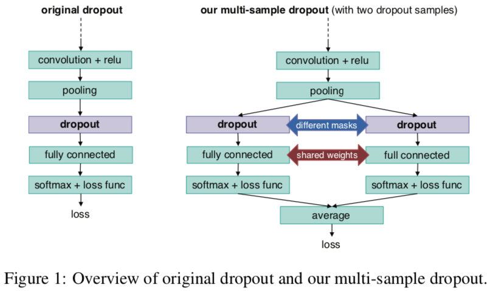
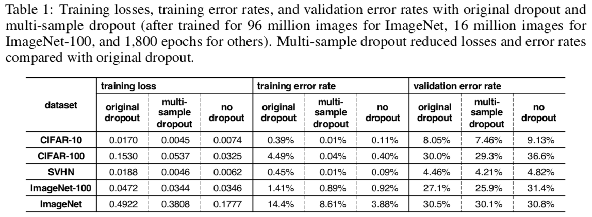

## Multi-Sample-Dropout

自从BN出来后，感觉BN的热度超过了此前的dropout。然而，最近一篇最新论文指出，其实dropout并没有想象的那么差，而是可以通过优化，来提升网络模型性能的。详细点击[原文](https://arxiv.org/pdf/1905.09788.pdf)

解读具体看下面的分析：

首先要知道dropout的工作原理，现在的dropout不如从前了，从前是在卷积层后也会使用（N年前），但现在一般卷积层后使用的是BN层来归一化输出，那么dropout用在哪呢？一般用在全连接层前面。

### dropout 原理
训练阶段，dropout首先会随机的选取50%（这个比例可以自己设置）的神经元，其他的都discard了。由于神经元之间关联性不强，这就起到了泛化的作用。但是在推理阶段，这些神经元都被用起来了，所以信息也就不会丢失。

### Multi-sample-dropout 原理
从另一个角度看这个原理：可以理解为dropout选择了输入集中的一个子集进行训练，相当于stacking方法中的子模型。事实证明，用多个子模型做模型融合可以提高模型的性能，那么我们用相同输入的不同自己去训练模型，理论上来说也可以提高模型的性能，并且同时降低训练时间以及提高了模型的泛化能力（文中的解释是，这相当于把原始数据加倍了，如果用M倍的dropout，则样品加M倍，其实本质来说是一样的，这里相当于对输入集进行重采样）。也就有了这篇论文。结构请看下图：

从图中可以看到，在相同输入集的多个子集中训练出来了多个子模型（用子模型比较容易理解），然后做平均（为什么不使用加权平均？？留个问题），其中包括对loss平均，对softmax中的每一类做平均，最高的作为预测值。然后把平均的loss输入到网络做bp。

### Multi-sample-dropout 为什么可以加速训练？

从multi-sample-dropout原理可以推出，是否使用更大的 mini-batch效果会更好呢？理论上是的，但是实际上会增加计算的耗时。而multi-sample-dropout成功的另一个原因是，dropou只使用在最后的几层（也就是特征提取后的几层）而全连接层的训练时间比卷积快（现在貌似时间都差不多吧），然后使用M个全连接层的耗时也不会增加太多。

### 实验部分

从上图可以看出，用multi-sample-dropout还是可以提升很多的性能的。还有一些其他的操作的比较没放这里。有兴趣的可以读读原文。挺有意思的。

